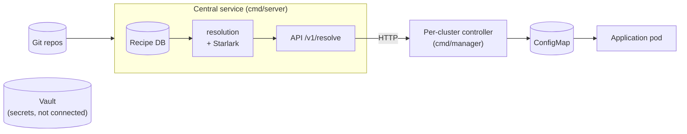

# configblender — design document

Configuration management tool for applications deployed across multiple Kubernetes environments, reconciling isolation between environments with maintainability — without duplicating configuration or scattering it across application code.

This document is a summary; the content is broken down by topic in [docs/](docs/):

1. [Problem statement and overview of existing strategies](docs/01-problem.md) — why the problem is real, and the limits of common approaches (hierarchy, interpolation, default values, in-app computation).
2. [Resolution model](docs/02-resolution-model.md) — declarative merge by key, provenance/explain (with the exact output format), static vs dynamic, state of the art, ordered layers and Starlark.
3. [Security: runtime nature and sandboxing](docs/03-security.md) — why sandboxing is required, how Starlark provides it natively, articulation with GitOps.
4. [Kubernetes integration](docs/04-kubernetes.md) — positioning relative to Vault, controller/CRD/reconciliation à la External Secrets Operator, the MVP's two outputs, non-goals.
5. [Recipe, database and CRD](docs/05-recipe-and-crd.md) — terminology, versioned storage of Recipes, Git sourcing of layers, CLI/API interface (read and authenticated write), web UI, CRD proposal.
6. [MVP scenarios](docs/06-mvp-scenarios.md) — S1 to S7, with their implementation status.
7. [Open questions](docs/07-open-questions.md).

## Overview

Full detail in [section 4](docs/04-kubernetes.md#42-central-component-multiple-target-clusters).

## Build

Orchestrated by [Task](https://taskfile.dev) (`Taskfile.yml`) rather than a Makefile — `task` lists the available tasks. The most useful ones: `task check` (build + vet + test), `task dev:server` (local central service, token `devtoken`), `task docker:build`, `task kind:load`. A point worth noting, documented in the Taskfile: `cmd/server` embeds the UI via `go:embed` ([internal/centralserver/ui.go](internal/centralserver/ui.go)), so nothing compiles until `task webui:build` has run at least once — every Go task depends on it.

## Implementation status

Go module (`configblender`): resolution engine, Recipe → Git → database chain, K8s controller, central service and CLI — all functional and tested, including against a real kind cluster.

| Package | Role | Status |
|---|---|---|
| `recipe` | `Recipe`/`Layer`/`MergeRule` types, declarative `Spec`/`LayerSpec` form + `Materialize` | Done, tested |
| `resolve` | Resolution engine: layer merging, sandboxed Starlark execution, provenance with redirection to the Git source (`Provenance`) | Done, tested |
| `gitsource` | Fetching layer content from Git + authentication (HTTP token, SSH) | Done, tested |
| `internal/gitauth` | Building Git credentials from the Git-source registry's stored `Auth` (`FromSources`, per-registered-source, docs/07-open-questions.md) — the Recipe DB is the only source of credentials, no environment fallback | Done, tested |
| `internal/gitsourcedb` | Registry of preconfigured Git sources (`{name, repo, auth}`) that a layer references by name instead of an inline repo URL | Done, tested |
| `recipedb` | Recipe storage (bbolt), versioned Vault-KV-v2-style (`Put`/`GetVersion`/`ListVersions`/`Rollback`) | Done, tested |
| `internal/recipesource` | Persistent Recipe+sources+Git store (one shared bbolt file), used by the CLI and the central service | Done, tested |
| `internal/cli` + `cmd/configblender` | CLI binary `put`/`rollback`/`list`/`get`/`history`/`resolve`/`explain`/`source`, local (`--db`) or via the central service (`--central-url`) | Done, tested, validated end to end |
| `api/v1alpha1` | Go types for the `ConfigBlend` CRD (+ `deploy/crd/configblend.yaml`) | Done |
| `internal/controller` + `cmd/manager` | Lightweight per-cluster controller (ConfigBlend → ConfigMap, ESO-style), resolution via `RecipeResolver` (local or network) | Done, tested (fake client **and** real kind cluster) |
| `internal/centralapi`/`centralserver`/`centralclient` + `cmd/server` | Central service (Recipe DB + Git-source registry + Starlark), public read + token-authenticated write (`CONFIGBLENDER_WRITE_TOKEN`) | Done, tested (including a real network round trip in-cluster) |
| `webui/` (Vue 3 + shadcn-vue), embedded in `cmd/server` | Vault-like UI: list, layer builder (sources selected by name), history + diff, rollback, Resolve/Explain tree, Sources admin | Done, validated in a real browser |

**Architecture validated against a real kind cluster** (see [docs/04-kubernetes.md §4.2](docs/04-kubernetes.md)): central service (Recipe DB + Git + Starlark) + lightweight per-cluster controller queried over HTTP, on the ESO+Vault model — `union` resolution/dynamic layer/ConfigMap/application mount all verified end to end. The UI was validated separately in a real browser (creation, editing, saving, version diff, rollback, authentication failure correctly rejected) rather than redeployed in-cluster.
