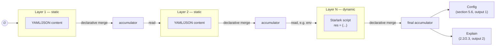

# 2. Resolution model

How configblender turns a stack of layers into a final configuration, independent of anything specific to Kubernetes (see [04-kubernetes.md](04-kubernetes.md) for cluster integration) or to runtime security (see [03-security.md](03-security.md)).

## 2.1 Declarative merge by key

In a hierarchical model, merging two configuration layers has no single semantics — it depends on the value's type:

- **Scalar** (`port: 8080` → `port: 9090`): override, no ambiguity.
- **Map/object**: recursive merge or not? Ansible settles this via a *global* setting (`hash_behaviour`), which is never right for every use case at once.
- **List**: the most problematic case — at least 4 legitimate semantics coexist depending on the list's business meaning:
  1. **Replace** — B fully overwrites A (expected for a complete whitelist).
  2. **Union** (deduplicated) — expected for additive plugins/features.
  3. **Append** (ordered, duplicates allowed) — useful for lists where order matters (e.g. middlewares executed sequentially).
  4. **Positional patch** — almost never desirable, a classic source of bugs.

The config format itself (YAML/JSON) carries no merge intent: the tool must either guess or enforce a global rule — and a global rule is almost always wrong for at least one use case in the project.

**Decision made**: the merge strategy must be **declarative and defined per key** (a Recipe's `mergePolicy`, see [05-recipe-and-crd.md](05-recipe-and-crd.md)), not a global setting applied uniformly to the whole configuration.

**MVP implementation** (`resolve` package): maps are always merged recursively and scalars are always overwritten by the last layer — only **lists** carry real key-level ambiguity, so `mergePolicy` only covers list-typed paths; `replace` is the implicit behavior for any unlisted path.

## 2.2 Traceability / provenance

With a classic hierarchical model, it's hard to tell, by looking at the final configuration, **which file or which level of the hierarchy produced a given value** — a concrete pain point experienced with Ansible.

**Need**: a projection of the configuration in which each value carries its source (layer, and where applicable the merge operation applied if the key was merged across several layers).

**Decision made for the MVP**: provenance is returned as a **mirror projection** of the full tree — a structure with the same shape as the final configuration, where each leaf is replaced by its source metadata — rather than an "explain" command targeted at a single key. This avoids polluting the shape actually consumed by the application (see [04-kubernetes.md §3](04-kubernetes.md) for the MVP's outputs) while still giving an exhaustive view rather than a key-by-key one.

**v1 granularity**: the source pointed to is the **layer** (its name), not the exact line in the file. File+line granularity only makes sense for static layers (YAML/JSON) and has no natural equivalent for a dynamic layer (a script has no "line" responsible for a value) — so layer-level granularity stays consistent between both source types and is sufficient for the MVP.

## 2.3 Explain output format

Implemented in `resolve.Result.Explain` (`map[string]any`) and exposed via `configblender explain` ([05-recipe-and-crd.md](05-recipe-and-crd.md) for the CLI interface).

**Shape**: the explain **exactly mirrors the final configuration tree** — same keys, same map nesting — but every **scalar or list leaf is replaced by a `Provenance`** (`resolve.Provenance`) instead of its value: the name of the layer that produced it, and — when that layer comes from Git (5.2/[05-recipe-and-crd.md](05-recipe-and-crd.md)) — the exact pointer (repo, path, ref), enabling **redirection to the source** rather than mere attribution by layer name.

Example, for a resolution with layers `base`, `env`, `computed` (the latter dynamic, Starlark):

```yaml
# final configuration
port: 8080
env: dev
foo: bar

# corresponding explain
port:
  layer: base
  source: {repo: "...", path: base.yaml, ref: main}
env:
  layer: env
  source: {repo: "...", path: env.yaml, ref: main}
foo:
  layer: computed
  source: {repo: "...", path: compute.star, ref: main}
```

`port` comes from `base` (never overwritten by later layers), `env` was redeclared by `env`, `foo` was added by the dynamic layer `computed`. The `source` field is omitted when the layer has no Git pointer (e.g. a test that builds a `recipe.Layer` directly, without going through `Spec.Materialize`).

**Case of lists**: a list is treated as a single leaf — its provenance is that of the **last layer to have touched it** (the one whose merge, whatever the strategy from 2.1, produced the list's final value), not a per-element attribution. A list built by `union` across three layers therefore only exposes the last contributing layer in the explain, not each element's originating layer — an accepted simplification for the MVP, consistent with the "layer" granularity from 2.2.

**Two lookup modes** (`configblender explain`, see [05-recipe-and-crd.md](05-recipe-and-crd.md)):
- **Full tree**: `configblender explain --recipe <name>` — YAML dump of the whole explain.
- **Targeted key**: `configblender explain --recipe <name> --key server.middlewares` — walks the dot-notation path in the explain and prints only what's there (the `Provenance` — layer + source — if it's a leaf, a YAML subtree if the path points to a map). Follows the spirit of `puppet lookup --explain` (2.5) in a more minimal form: no trace of candidates rejected at each hierarchy level, only the final attribution.
- Both modes work identically locally (`--db`) or via the central service (`--central-url`, [05-recipe-and-crd.md §5.3](05-recipe-and-crd.md)) — only the internal Go representation differs (`resolve.Provenance` locally, `map[string]any` decoded from JSON remotely, docs/07-open-questions.md), the YAML output is identical.

**Annotated view** (`--annotate`, additive on top of either mode above — `internal/cli.FormatAnnotated`): rather than two separate trees (Config, then Explain, matched up by hand), folds them into one — the config's actual shape, each leaf followed by a trailing `# layer (repo@ref:path)` comment:

```yaml
port: 8080  # base (git@example.com/app.git@main:base.yaml)
env: dev  # env-override
server:
  middlewares:  # computed
    - auth
    - ratelimit
```

Composable with `--key` (renders just that subtree or leaf, same as the raw modes above). The webui's Explain tab renders the same (Config, Explain) pair as an equivalent collapsible tree instead of text, colored per layer.

## 2.4 Static vs dynamic

- **Static formats, primary**: YAML and JSON.
- **Dynamic part**: some configuration layers are computed via an **interpretable language** built into the resolution pipeline (2.6), rather than scattered across application code the way the "in-app computation" strategy does ([01-problem.md](01-problem.md)).

## 2.5 State of the art

| Tool | Contribution | Limitation |
|---|---|---|
| Kubernetes Strategic Merge Patch | Best example of declarative per-field merge (`patchStrategy`, `patchMergeKey`, `x-kubernetes-list-type`) | Locked into the K8s type system (Go/OpenAPI), not reusable as-is outside K8s |
| Carvel ytt (overlays) | Declarative per-node annotations (`@overlay/merge`, `@overlay/replace`, `@overlay/append`, `@overlay/insert`) | The strategy is carried by the override file rather than a central schema — no guarantee of consistency across overrides |
| Puppet Hiera | `lookup_options` allows a declarative merge strategy *per key* (`first`/`hash`/`deep`); `puppet lookup --explain` provides real resolution traceability across the hierarchy | Fixed presets, no fine-grained replace/union/append distinction on lists |
| CUE | Sidesteps the problem with a different paradigm: unification rather than "last wins" override — any redeclaration of a key must be consistent with previous ones | No dedicated provenance mechanism |

**Observation**: no existing tool combines a rich, declarative per-key merge (beyond Hiera's presets) with per-value provenance (Hiera's `--explain`-style). This is a blind spot in the current ecosystem, and thus a legitimate differentiator for configblender rather than a reinvention.

## 2.6 Layer model and dynamic resolution

The final configuration is the result of an **ordered sequence of layers**, each either static (YAML/JSON) or dynamic (script). A dynamic layer receives as input the configuration already resolved by the previous layers (the accumulator), and returns a (partial) object that is then merged into the accumulator according to the declarative merge rules (2.1).

Example:

```yaml
# Layer A (static)
env: dev
```

```python
# Layer B (dynamic)
res = {}
if env in ["dev", "staging"]:
    res["foo"] = "bar"
```

```yaml
# Result A + B
env: dev
foo: bar
```

Generalized to an N-layer Recipe, each layer merging its result into the accumulator produced by the previous layers (2.1), while feeding the provenance projection in parallel (2.2/2.3):



Each "declarative merge" arrow applies the rules from 2.1 (scalar: override, map: recursive, list: declared strategy) and attributes any new or modified leaf to the current layer in the Explain projection (2.3).

Consequence: **layer order is semantically significant** — unlike CUE (2.5), which aims for order-independence via unification, this model assumes explicit sequential resolution. This is a deliberate design choice, accepted as a divergence from the CUE approach.

**Language chosen for v1: Starlark.** Decision criterion: the lightest possible language for dynamic layers. Starlark (derived from Python, designed for embedding — Bazel, Buildkite) has a pure Go implementation (`go.starlark.net`), so it integrates directly into the controller ([04-kubernetes.md](04-kubernetes.md)) without a subprocess or external runtime — lighter than embedding CPython or Node. It is also hermetic by default (no file/network access unless explicitly exposed by the host), which fits the coarse-grained sandboxing-by-isolation approach rather than a method whitelist ([03-security.md](03-security.md)): a good part of the security constraint becomes a property of the language rather than a mechanism to build.

**Dynamic layer output convention (implementation)**: the script assigns its result to a global named `res` (`resolve.resultVar`); there is no module-level `return` in Starlark (only inside a function), hence this convention rather than a `return` at the end of the script.

**Multi-language extensibility**: the execution mechanism for a dynamic layer is still designed as a language-independent interface (generic contract: input = serialized accumulated config, output = serialized object), so other languages can be added later without changing the resolution engine. This is not a functional priority for v1 (Starlark alone is enough), but it is an architectural constraint from the start.

Link to provenance (2.2/2.3): the source of a value produced by a dynamic layer is that layer's name — treated as a source type in its own right, on equal footing with a static layer.
