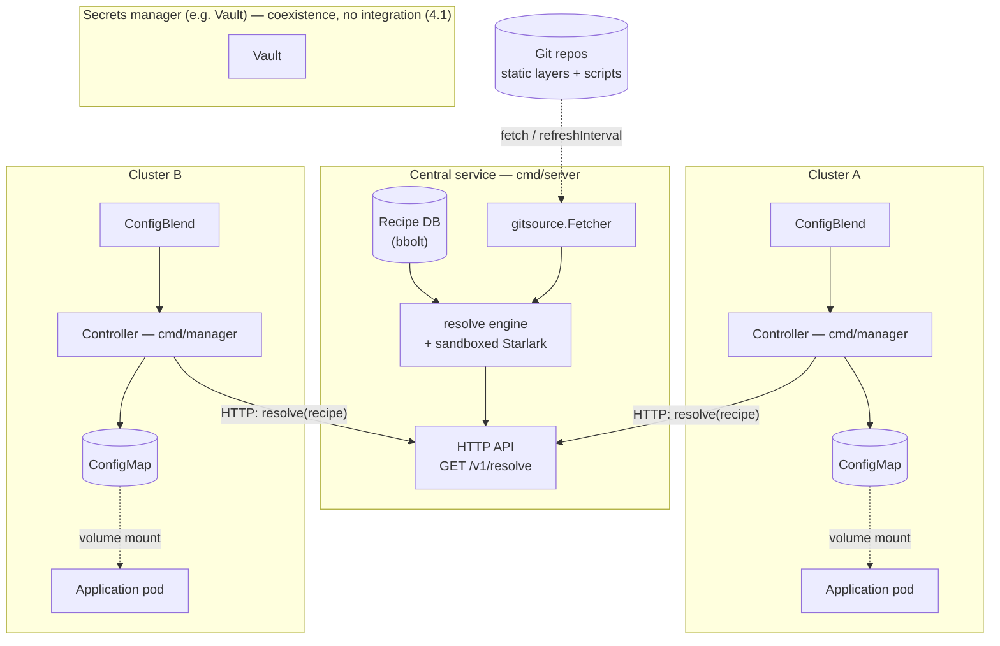
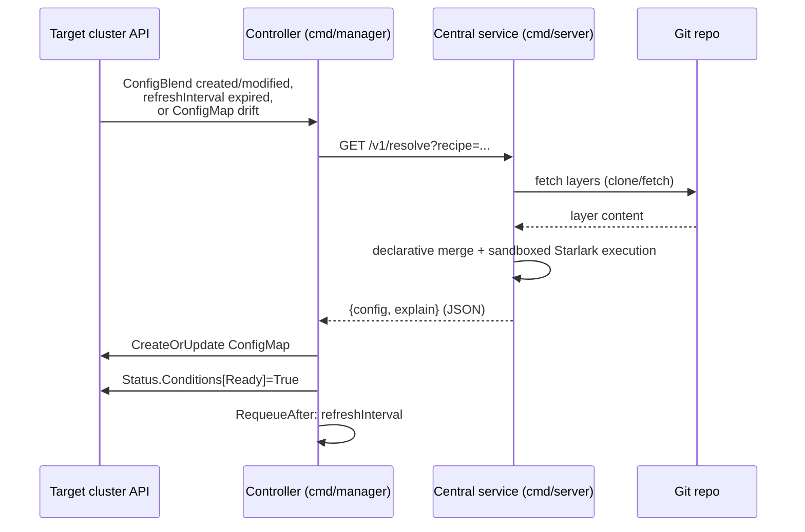

# 4. Kubernetes integration

## 4.1 Positioning relative to secrets managers (e.g. Vault)

In a Kubernetes environment, secrets are normally managed by a dedicated system (Vault, etc.) and injected separately (K8s Secrets, sidecar, CSI driver...). In the absence of a suitable tool for *non-secret* configuration, this kind of system is often repurposed to store all application configuration — the secret/config distinction blurs.

**Project positioning**: configblender is not meant to integrate technically with a secrets manager (no API calls, no Vault reference resolution). It simply needs to be able to **coexist alongside one**: each stays responsible for its own scope (secrets for Vault, the rest of the configuration for configblender), with no overlap or technical dependency between the two. Proper coverage of non-sensitive configuration by configblender removes the reason to repurpose a secrets manager beyond its intended use.

Consequence for the provenance model ([02-resolution-model.md §2.2](02-resolution-model.md)): no "external manager" source type to model — configblender's scope by construction excludes values managed by a secrets system; provenance only covers sources internal to configblender (static layers, dynamic layers).

## 4.2 Central component, multiple target clusters

**Decision**: configblender is not necessarily deployed in the same cluster(s) as the `ConfigBlend` resources it reconciles. It splits into two components, following the exact model of **External Secrets Operator + HashiCorp Vault**, already used as the reconciliation reference (4.3/[02-resolution-model.md §2.5](02-resolution-model.md)):

- **A lightweight controller, deployed locally in each target cluster** — exactly like ESO runs in each cluster it serves, with its own `ServiceAccount` and its own local RBAC permissions (no other cluster's kubeconfig to manage). It watches the `ConfigBlend` resources in its own cluster (unchanged), but no longer holds the Recipe database or the Git/Starlark logic: for each reconciliation, it **calls the central service over a network API** to get the resolved tree.
- **A central service, potentially shared by several clusters** — the counterpart of Vault in this parallel: it holds the Recipe database ([05-recipe-and-crd.md §5.2](05-recipe-and-crd.md)), the Git fetch, and the Starlark execution. A local controller merely asks it to resolve a named Recipe; it knows nothing about Git or Starlark.

This split is simpler than the alternative considered for a while (a central controller holding one kubeconfig per target cluster): each cluster keeps its standard, local K8s controller behavior (identical to an ESO deployment), and the only new credential to manage per cluster is access to the central service — a shape of problem already solved for Git (5.2), not a new kind of problem (managing N kubeconfigs).

Each controller only knows its own cluster (local RBAC, no other cluster's kubeconfig); the central service knows no K8s cluster at all — it only resolves Recipes on request. Vault stays deliberately disconnected from the diagram: no edge links it to configblender (4.1).

- **Consequence for the Recipe (5.1/[05-recipe-and-crd.md](05-recipe-and-crd.md))**: reinforces the already-made choice to store Recipes in a central database rather than in a per-cluster CRD — a Recipe is defined once in the central service and reused by several target clusters.
- **Implementation chosen**: the contract between the controller and the central service is the same one already used locally (`Resolve(name) (*resolve.Result, error)`) — abstracted as an interface (`internal/controller.RecipeResolver`) rather than hardcoded against `internal/recipesource.Store`. The controller's reconciliation logic stays unchanged; only the concrete implementation of this interface changes: `internal/recipesource.Store` (local call, simple single-process/single-cluster case, e.g. the kind test) or a network client to the central service (real multi-cluster deployment).

## 4.3 v1 scope: Kubernetes target

The deployment target for v1 is Kubernetes. That concretely frames several points:

- Coexistence with a secrets manager (4.1): concrete use case = Vault + injection via K8s Secrets/CSI driver, configblender producing the non-sensitive configuration.
- **Decision made**: the v1 output mechanism is a **ConfigMap** managed by configblender. Architectural consequence: configblender operates as a **controller** in the cluster (in the K8s sense — a process that computes a desired state and reconciles it via the K8s API), not as a sidecar in each application pod. The application consumes the ConfigMap through the native K8s mechanism (volume mount), with no direct dependency on configblender or a custom protocol.
- **Stack chosen: Go.** Consistent with the native K8s controller ecosystem (client-go, controller-runtime — the same one ESO uses, taken as the reconciliation model below) and with embedding Starlark (pure Go implementation, [02-resolution-model.md §2.6](02-resolution-model.md)) without a cross-language dependency.
- This moves where dynamic layers execute (and thus the sandboxing scope, [03-security.md](03-security.md)) to the configblender controller pod itself — a dedicated component, independently isolable, rather than duplicated as a sidecar in every application pod.
- **Reconciliation model chosen: that of External Secrets Operator (ESO)**, carried over from secret synchronization to configuration resolution — consistent with positioning as a Vault complement (4.1), of which ESO is precisely the reference operator on the secrets side. Elements carried over:
  - A **declarative CRD** (the equivalent of `ExternalSecret`) describes which Recipe to resolve and the target ConfigMap to produce, with a `refreshInterval` (duration string, e.g. `1h`, default) controlling how often periodic re-resolution happens — see [05-recipe-and-crd.md](05-recipe-and-crd.md) for the CRD proposal.
  - **Reconciliation triggers**, carried over as-is from the ESO model: (1) creation/modification of the declarative resource, (2) `refreshInterval` expiry, (3) drift detected on the target ConfigMap (manual edit/deletion → reconciled back to the desired state), (4) change on a watchable layer source, where applicable.
  - `refreshInterval` is the central mechanism for catching changes on the dynamic-layer side (a computed value can change without the layer declaration itself changing) — directly answers the "runtime, continuously evaluated" nature established in [03-security.md](03-security.md), without requiring a continuous watch on external sources that don't all support one.
  - **v1 decision**: periodic polling only (like ESO), no dedicated watch even for layer sources internal to the cluster — consistent with the "single trigger mechanism" principle rather than maintaining two paths for the MVP. Default value chosen: `1h` (`controller.DefaultRefreshInterval`).

On a resolution failure, the same sequence stops right after the central service's response: the controller sets `Ready=False` with the error message and still requeues at `refreshInterval` (see below), never reaching the `CreateOrUpdate` step.
- **Resolution-failure handling (implementation)**: a resolution failure (Recipe not found, Git repo unreachable...) does not fail the reconciliation in the controller-runtime sense — the controller sets a `Ready=False` condition with the reason on the `ConfigBlend` and reuses `RequeueAfter: refreshInterval` instead of returning an error. Returning an error would have triggered controller-runtime's exponential backoff instead of the expected steady rhythm (docs/05-recipe-and-crd.md, tested: `internal/controller.TestReconcile_ResolveFailureRequeuesWithoutError`).
- **Integration with the K8s ecosystem beyond direct ConfigMap output (Kustomize, Helm)**: confirmed out of scope for v1 — consistent with the fact that the ConfigMap managed by configblender is itself the final artifact, with no further composition step expected for the MVP.

## 4.4 MVP outputs

The MVP produces **two distinct outputs** for a given resolution:

1. **Final configuration tree** — the result of merging all layers ([02-resolution-model.md §2.1](02-resolution-model.md)), the artifact actually consumed by the application (volume mount of the single ConfigMap, 4.3). **v1 decision**: YAML for both outputs (final tree and explain), for consistency and simplicity — the output format is still designed to be interchangeable (JSON in particular) for a later version, though that's not a v1 goal.
2. **Explain of the tree** — the provenance mirror projection ([02-resolution-model.md §2.2/§2.3](02-resolution-model.md)): same structure as the final tree, but each leaf carries its source instead of its value. **Decision made: no ConfigMap for the explain.** Intended for an operator doing debugging, it's consulted directly from configblender (CLI, see [05-recipe-and-crd.md](05-recipe-and-crd.md)) rather than published as a persistent object in the cluster. This also reduces the surface exposed by the final ConfigMap (simpler RBAC: only the configuration actually consumed by the app is visible there).

The final tree is the only one concerned by the question of ConfigMap(s) — with a single ConfigMap output, the "one or many" question no longer arises for the MVP.

## 4.5 v1 non-goal: schema validation

Managing a validation schema (typing, detecting a missing/incorrect key before deployment) **is not a v1 goal**. This is explicitly noted as a non-goal rather than an unsolved problem, so as not to leave the question open indefinitely within scope.
