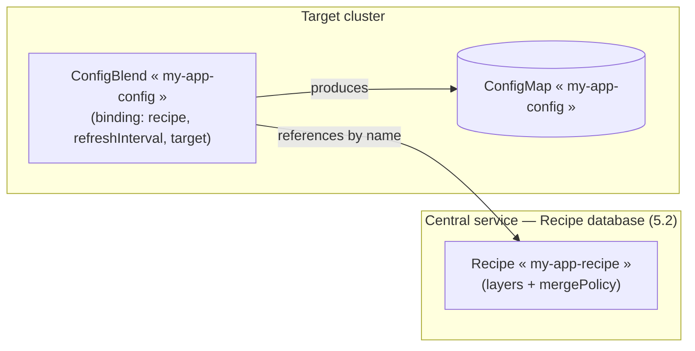

# 5. Recipe, database and CRD

## 5.1 Terminology: Recipe

The name given to the ordered stack of layers (static and dynamic) and its associated `mergePolicy` ([02-resolution-model.md §2.1](02-resolution-model.md)) — what configblender executes to produce a resolved configuration tree. Implemented by `recipe.Recipe` (materialized form, ready to resolve) and `recipe.Spec` (stored declarative form, see 5.2).

## 5.2 Recipe stored in a database

**Decision**: a Recipe **is not carried by the reconciled CRD**. It's part of configblender's own configuration — **configblender manages its Recipes in its own database**, rather than in a K8s object (CRD or ConfigMap). Consequence: configblender is no longer a simple stateless controller reading the K8s API (like ESO) — it's a **stateful service**, with persistent storage to operate (durability, backup), and a way to write/edit a Recipe (CLI, see 5.3) since `kubectl apply` can no longer serve as an entry point for that.

**MVP implementation chosen: embedded storage (bbolt)**, rather than an external service (PostgreSQL...) — a Recipe is accessed by name, with no relational query needed, so an embedded key/value store is enough and adds no service to operate. Same reasoning ("the lightest thing that fits the need") as for the choice of Starlark ([02-resolution-model.md §2.6](02-resolution-model.md)). Package `recipedb`: `Put`/`Get`/`Delete`/`List`, JSON serialization of `recipe.Spec`.

**Editing and history, modeled on Vault (KV v2)**: every `Put` creates a **new version** rather than overwriting the previous one (`Put`/`GetVersion`/`ListVersions`/`Rollback`) — a Recipe's full history stays browsable, and `Rollback` restores an old version by writing a **new** version with its content (history is never rewritten, even for a rollback). Deliberate difference from Vault: values are **not masked** — a Recipe carries no secret ([04-kubernetes.md §4.1](04-kubernetes.md)), so this mechanism is a pure audit/rollback tool, not an access control.

**Web UI (built): `webui/` (Vue 3 + shadcn-vue + Tailwind), served by the central service itself.** The built assets (`npm run build`, output in `internal/centralserver/ui/`) are embedded in the binary (`//go:embed`, `internal/centralserver/ui.go`) — no separate frontend service to deploy, same "single component to operate" reasoning as for bbolt/Starlark. Features: Recipe list, a layer builder (add/reorder/remove layers, each pointing at a preconfigured Git source by name — 5.2bis — with a JSON-advanced fallback for `mergePolicy` and anything else), version history, line-by-line diff between a past version and the latest, rollback with confirmation, a Resolve/Explain tab that calls `/v1/resolve` to preview the result as a collapsible tree colored per source layer — including provenance with redirection to each value's Git source (2.3) — and a Sources admin screen to register/remove Git sources.

**Relationship with GitOps ([03-security.md](03-security.md)) — clarified**: what lives in the database is the Recipe's **structure** (which layers, in what order, `mergePolicy`) — not the layers' **content**. Content (static YAML/JSON files, Starlark scripts) **stays versioned in a Git repository**, so it stays reviewable in a PR. Each layer entry in a Recipe references its content via a `LayerSource` (`recipe.LayerSpec.Source`): a **reference to a preconfigured Git source by name** (`sourceRef`) plus a path and ref within it, rather than an inline repo URL — see 5.2bis.

**Architectural consequence**: configblender must itself **fetch layer content from Git** at resolution time (`gitsource.Fetcher`: in-memory clone, `Fetch` on every call, following the same polling logic as `refreshInterval` — [04-kubernetes.md §4.3](04-kubernetes.md)). The database therefore only stores the Recipe's structure/metadata, not the layer content itself (no duplicated source of truth between Git and the database). `recipe.Spec.Materialize(fetcher, sources)` performs this step — resolving each layer's `SourceRef` to a repo URL via `sources` (a `recipe.SourceResolver`) before fetching — and produces a `recipe.Recipe` ready for `resolve.Resolve`.

Implementation point worth noting: `Fetch` updates the remote-tracking refs (`refs/remotes/origin/*`) but not the local branch frozen at the initial clone (standard git behavior) — `gitsource` therefore resolves the remote ref first, falling back to the raw ref for tags/SHA/HEAD.

## 5.2bis Preconfigured Git sources

**Decision**: a layer never embeds a raw repo URL. Instead, `internal/gitsourcedb` stores a small registry of named Git sources — `GitSource{Name, Repo, Auth}`, sharing the same bbolt file as the Recipe database (`internal/recipesource.Open`, one `*bbolt.DB`, two buckets) — and a layer's `LayerSource.SourceRef` references one by name. The webui's layer builder only ever offers a `<select>` of registered names; the Sources admin screen (`webui/src/components/SourcesAdmin.vue`) is where a source's repo URL and credentials are entered, once, separately from any Recipe.

**Repository authentication (implemented, per-source, DB-backed)**: `gitsource.AuthResolver` (a `repoURL -> (transport.AuthMethod, error)` function) is built by `internal/gitauth.FromSources(lookup)`: for a fetch's repo URL, it asks `lookup` (backed by `gitsourcedb.Store.LookupByRepo`, always current) which registered `GitSource` owns it, then converts that source's own stored `Auth` (`internal/gitauth.AuthMethod`) — HTTP basic auth from `Username`+`Password` (`Password` doubling as a personal access token), or SSH from `SSHKey`/`SSHUser`/`SSHKeyPassphrase`. **The Recipe DB is the single source of truth for Git credentials — there is no environment-variable fallback and no global credential** (this reopens `docs/04-kubernetes.md §4.1`'s "configblender stores no secret material" framing, deliberately, in exchange for the webui's Sources admin screen being able to configure *and test* a source's credentials in one place, docs/07-open-questions.md). A repo URL with no registered source, or a registered source with no stored `Auth`, fetches unauthenticated.

**Write-only over the API and webui**: `PUT /v1/sources/{name}` accepts `Auth`, but `GET /v1/sources` never includes it in the response (`internal/centralserver`'s handlers construct that DTO without the field) — a stored credential is never echoed back, mirroring how `CONFIGBLENDER_WRITE_TOKEN` itself is handled. `POST /v1/sources/test` (`internal/centralapi.TestConnectionPath`) checks a repo/credential pair — saved or not — via `gitsource.TestConnection` (a cheap `git ls-remote`-equivalent, no clone), used by both the webui's "Test connection" button and `configblender source test`.

**API and CLI**: `GET /v1/sources` (public, credential-free), `PUT /v1/sources/{name}`, `DELETE /v1/sources/{name}`, and `POST /v1/sources/test` (all write-token gated, same token as Recipe writes) — see 5.3. `configblender source put`/`source test` accept credentials via `--username`/`--password`/`--password-stdin` (HTTPS) or `--ssh-key-file`/`--ssh-user`/`--ssh-key-passphrase` (SSH) — `--password-stdin` avoids putting a secret in shell history or `ps`. Unlike Recipes, sources carry no version history: they're operational config, not audited/rolled-back content.

## 5.3 CLI and API interface — read and write

**Read: local or via the central service**, either way, with exactly the same output in both cases — `cmd/configblender` accepts `--db <path>` (local database) or `--central-url <url>` (central service over HTTP, [04-kubernetes.md §4.2](04-kubernetes.md)), mutually exclusive:

- `configblender list (--db <path> | --central-url <url>)` — lists known Recipe names.
- `configblender get (--db <path> | --central-url <url>) --recipe <name> [--version <n>]` — prints the declarative Spec as YAML (the latest version, or a specific one) — chains naturally with `put` for an edit flow (get, edit the YAML, put).
- `configblender history (--db <path> | --central-url <url>) --recipe <name>` — lists the version history (number + timestamp).
- `configblender resolve (--db <path> | --central-url <url>) --recipe <name>` — resolves the named Recipe and prints the final tree as YAML (output 1 from [04-kubernetes.md §4.4](04-kubernetes.md), produced here outside of the ConfigMap managed by the controller).
- `configblender explain (--db <path> | --central-url <url>) --recipe <name> [--key <dotted.path>] [--annotate]` — prints the full explain, or a single key's provenance; `--annotate` folds Config and Explain into one config-shaped tree with each value commented by its source layer instead of a separate provenance tree ([02-resolution-model.md §2.3](02-resolution-model.md)).
- `configblender source list (--db <path> | --central-url <url>)` — lists registered Git sources (5.2bis).

On the central-service side, these same reads are exposed over HTTP (`internal/centralserver`): `GET /v1/resolve?recipe=<name>`, `GET /v1/recipes` (list), `GET /v1/recipes/{name}` (latest version), `GET /v1/recipes/{name}/versions` (history), `GET /v1/recipes/{name}/versions/{n}` (a specific version), `GET /v1/sources` (list registered Git sources, 5.2bis) — no authentication.

### 5.3bis Authenticated network write (revision of the initial decision)

**The "GitOps only, no push API" decision was revised** to allow editing/rollback from the web UI (5.2) and the remote CLI:

- `PUT /v1/recipes/{name}` (body: `recipe.Spec` JSON) — creates a new version.
- `POST /v1/recipes/{name}/rollback` (body: `{"version": n}`) — restores an old version as a new version.
- `configblender put (--db <path> | --central-url <url>)` and `configblender rollback (--db <path> | --central-url <url>)` — same subcommands as before, now also usable in network mode.
- `PUT /v1/sources/{name}` (body: `{"repo": "...", "auth": {...}}`) and `DELETE /v1/sources/{name}` — register/replace or remove a Git source, credentials included (5.2bis); `configblender source put (--db <path> | --central-url <url>) --name <name> --repo <url> [credential flags]` and `configblender source delete (--db <path> | --central-url <url>) --name <name>`.
- `POST /v1/sources/test` (body: `{"repo": "...", "auth": {...}}`) — checks a repo/credential pair without saving it (5.2bis).

**What this changes, and what it doesn't**: only the Recipe's **structure** (which layers, in what order, `mergePolicy`) becomes editable over the network. Layer **content** (static files, Starlark scripts) remains exclusively Git-sourced and therefore reviewable in a PR (5.2) — that part of the GitOps guarantee hasn't moved. What changed is who can decide *which* layers, in what order, without going through a code review.

**Authentication**: every write endpoint requires the write token, presented one of two ways: `Authorization: Bearer <token>` (API/CLI clients — `internal/centralclient`, `configblender`), compared in constant time against `CONFIGBLENDER_WRITE_TOKEN` (an environment variable of the central service, fed from a mounted K8s Secret); or a session cookie (the webui) obtained from `POST /v1/login` (body `{"token": "..."}`) — `internal/centralserver/session.go` issues an HMAC-signed cookie (keyed by a hash of the write token, so no server-side session store is needed and outstanding sessions survive a restart), valid for 7 days or until `POST /v1/logout`. `GET /v1/session` reports `{"authenticated": bool}` so the webui can render real login state instead of inferring it from a write's success/failure. Either credential is equally sufficient; the webui exists to remove needing to attach a header to every request by hand, not to add a second, weaker credential. An empty `CONFIGBLENDER_WRITE_TOKEN` disables both write endpoints and login (403), rather than opening them by default. Reads stay unauthenticated. Accepted limitation: still a single shared secret behind the login, no distinct users or audit of who wrote what (version history knows *when*, not *who*) — see [07-open-questions.md](07-open-questions.md).

## 5.4 CRD proposal (v1alpha1)

Consequence of 5.2: the reconciled CRD becomes a **binding** resource, which references a Recipe by name and declares the target + refresh cadence — with no inline configuration content. This echoes, without formally settling it, the source/binding split à la `SecretStore`/`ExternalSecret` (see [07-open-questions.md](07-open-questions.md)): the Recipe plays the role of the source, this CRD the role of the binding.



A single Recipe can in principle be referenced by several `ConfigBlend` resources (in the same cluster or across different clusters), each with its own target ConfigMap name and its own `refreshInterval` — useful for applying the same base configuration to several deployments without duplicating the Recipe. See [07-open-questions.md](07-open-questions.md) for what remains to be settled on this point.

```yaml
apiVersion: configblender.io/v1alpha1
kind: ConfigBlend
metadata:
  name: my-app-config
  namespace: my-app
spec:
  recipe: my-app-recipe      # referenced by name, no inline content
  refreshInterval: 1h        # 04-kubernetes.md §4.3 — ESO-style polling
  target:
    configMapName: my-app-config   # 04-kubernetes.md §4.3/§4.4 — single output
```

For reference, a Recipe's conceptual structure (ordered layers + centralized `mergePolicy`, [02-resolution-model.md §2.1](02-resolution-model.md)) is still the one sketched by `recipe.Spec` (5.1) — only where it's defined (database, not the CRD) changes, not its shape.

**Points still to be settled**: see [07-open-questions.md](07-open-questions.md) — Recipe-definition mechanism (resolved as: database, 5.2), exact `mergePolicy` syntax (nested paths/wildcards), whether a Recipe can be referenced by several binding CRDs.
